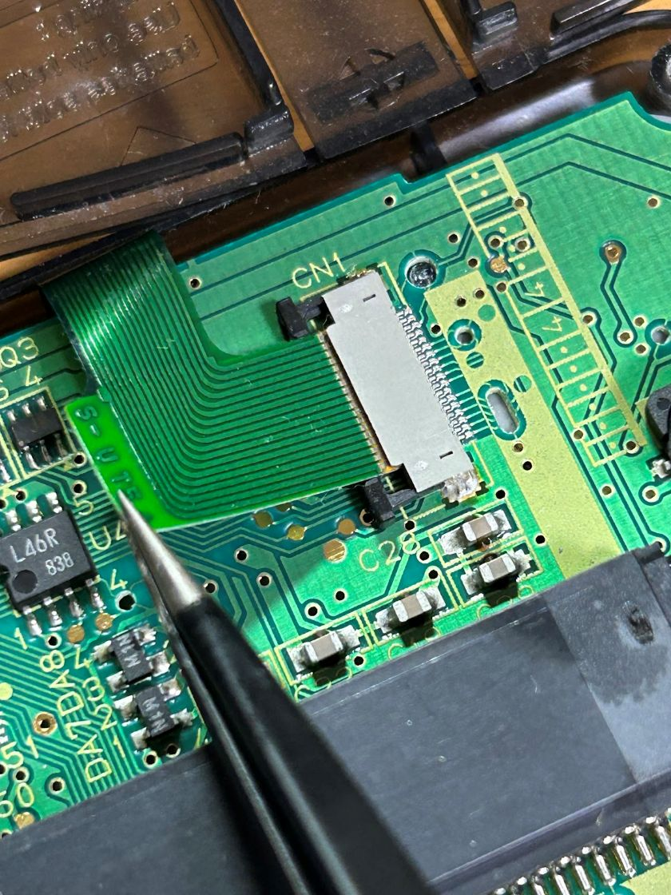

# 冬夢のレトロゲーム攻略メモ 表記・運用ルール

最終更新日：2026/06/14

このメモは、GitHub Pages版「冬夢のレトロゲーム攻略メモ」で記事を作成・移行するときの表記ルールをまとめたものです。

このファイルはサイト運用メモのため、通常の記事ページからはリンクしません。
また、`sitemap.xml` にも追加しません。
追加されていた場合などは気づいた時点でリンクやサイトマップから削除が必要です。

（ここの部分だけはサイト運用メモなどとは関係ありません、私宛の私の個人的なメモです。）
まず前提として、データ収集や本文作成は自分の手でプレイして集めたり書いたうえで、
文章の読みやすさやHTMLコードなど複雑な点を補助するためにAIの助けを借りることが重要です。

私にとってこのブログの目的、重要な点はレトロゲームをプレイする人の助けになれる事です。
今の時代、説明書無しのソフト単体で販売されている場合が多いです。プレイする時必要な情報がこのサイトから得られるように、
攻略に行き詰まった時に、私が得た知識の一部でも役に立てば助かる人がいるかもしれません。
西暦1998年頃にあった昔の個人攻略サイトなどは失われつつあるでしょう。
あの人たちが作り上げたレベルとはいかなくても、私が不完全でも新しく発信していけば未来に繋がる物もあるかもしれません。

小さくても、未熟でも構いません。
何年後にも何十年後にもなるかもしれませんが、あなたが作り上げた物が誰かの助けになるかもしれません。
見知らぬ誰かが作った攻略サイトに助けられた事を忘れないで、今度はあなたがその見知らぬ誰かになれたなら…
きっとそれが私の、あなたの人生を使ってでも成し遂げるモノのひとつに成り得るでしょう。

最後に、もしこのページを見つけた方がいらっしゃいましたらそっとしておいてください。
「小さな幻想の小部屋」このブログの別名としてつけています。
私が望むのは小さくても幻のように儚くても構いません、私が幸せだと信じられる物の為に生きようとしています。
このブログもその一つです。


## 保存場所

```text
note/site-style-guide.md
```

## サイト名

```text
冬夢のレトロゲーム攻略メモ
```

## 記事タイトルの方針

攻略記事では、基本的に【ゲーム攻略】のようなラベルは付けない。

例：

```text
『魔法陣グルグル』（SFC）ストーリー攻略 前半｜オープニング～聖なる塔
```

修理・メンテナンス系の記事では、カテゴリが分かりやすいように【修理記録】を付けてもよい。

例：

```text
【修理記録】ワンダースワンの偏光板を交換してみた
```

プレイ感想記事では、必要に応じて自然なタイトルにする。

例：

```text
『魔法陣グルグル』（SFC）プレイ感想｜遊んでみた感想まとめ
```

## ファイル名の方針

英小文字・ハイフン区切りを基本にする。

例：

```text
story-walkthrough-01.html
story-walkthrough-02.html
guruguru-list.html
item-equipment-list.html
play-impressions.html
```

## 基本HTMLテンプレート

作品フォルダ内の記事では、基本的に以下の形を使う。

```html
<!doctype html>
<html lang="ja">
<head>
  <meta charset="UTF-8">
  <meta name="viewport" content="width=device-width, initial-scale=1.0">
  <title>記事タイトル - 冬夢のレトロゲーム攻略メモ</title>
  <meta name="description" content="記事の説明文を入れる。">
  <link rel="stylesheet" href="../style.css">
</head>

<body>
  <header>
    <h1>記事タイトル</h1>
    <p>
      <a href="../index.html">トップページへ戻る</a> /
      <a href="index.html">攻略目次へ戻る</a>
    </p>
  </header>

  <main>
    <!-- 本文 -->

    <p>
      <a href="index.html">→ 攻略目次へ戻る</a>
    </p>

    <hr>

    <div class="note">
      <p>
        <strong>【作品について】</strong><br>
        本ページで扱う作品名・各種権利は、各権利者に帰属します。<br>
        『作品名』（機種名）<br>
        ©権利表記
      </p>

      <p>
        最終更新日：YYYY/MM/DD
      </p>
    </div>
  </main>

  <footer>
    <p>&copy; 2026 冬夢のレトロゲーム攻略メモ</p>
  </footer>
</body>
</html>
```

## meta description の方針

`meta name="description"` には、検索結果に出ても自然な短い説明を入れる。

長くしすぎず、記事内容が分かるようにする。

例：

```html
<meta name="description" content="スーパーファミコン版『魔法陣グルグル』のストーリー攻略前半です。オープニングから聖なる塔までの出現モンスター、宝箱、攻略メモをまとめています。">
```

プレイ感想記事の例：

```html
<meta name="description" content="スーパーファミコン版『魔法陣グルグル』を最後まで遊んでみた感想です。戦闘や成長、アイテム・お金まわり、気になった点などをまとめています。">
```

## 作品権利表記

記事下部では「出典」ではなく、基本的に【作品について】表記を使う。

```html
<hr>

<div class="note">
  <p>
    <strong>【作品について】</strong><br>
    本ページで扱う作品名・各種権利は、各権利者に帰属します。<br>
    『作品名』（機種名）<br>
    ©権利表記
  </p>

  <p>
    最終更新日：YYYY/MM/DD
  </p>
</div>
```

『魔法陣グルグル』（SFC）の場合：

```html
<hr>

<div class="note">
  <p>
    <strong>【作品について】</strong><br>
    本ページで扱う作品名・各種権利は、各権利者に帰属します。<br>
    『魔法陣グルグル』（スーパーファミコン）<br>
    ©1995 衛藤ヒロユキ・TAM・TAM・ABC・電通・日本アニメーション・エニックス
  </p>

  <p>
    最終更新日：YYYY/MM/DD
  </p>
</div>
```

## 最終更新日の表記

ページ本文では、以下の形式を使う。

```text
YYYY/MM/DD
```

例：

```text
最終更新日：2026/06/14
```

サイトマップでは、以下の形式を使う。

```text
YYYY-MM-DD
```

例：

```xml
<lastmod>2026-06-14</lastmod>
```

## リンクの方針

作品別攻略目次へ戻るリンクは、同じ作品フォルダ内では以下を使う。

```html
<a href="index.html">→ 攻略目次へ戻る</a>
```

作品名を入れる場合は以下のようにする。

```html
<a href="index.html">→ 魔法陣グルグル攻略目次へ戻る</a>
```

トップページへ戻るリンクは、作品フォルダ内の記事では以下を使う。

```html
<a href="../index.html">トップページへ戻る</a>
```

ヘッダーで両方を表示する場合：

```html
<p>
  <a href="../index.html">トップページへ戻る</a> /
  <a href="index.html">攻略目次へ戻る</a>
</p>
```

## noindex の方針

通常の攻略記事・修理記事・プレイ感想記事は、基本的に `noindex` を付けない。

お問い合わせページ、プライバシーポリシー、運用メモなど、検索から来る必要が薄いページでは `noindex` を検討する。

HTMLページとして作る場合は、`head` 内に以下を入れる。

```html
<meta name="robots" content="noindex, follow">
```

サイト運用メモのように、検索にもリンク巡回にも出したくないページをHTMLで作る場合は、以下を使う。

```html
<meta name="robots" content="noindex, nofollow">
```

ただし、`site-style-guide.md` は運用メモとして置くため、基本的にサイト内からリンクせず、`sitemap.xml` にも入れない。

## CSSの使い分け

補足・注意書きには `.note` を使う。

```html
<p class="note">
  ※補足説明をここに入れる。
</p>
```

複数段落の補足や作品表記では、`div class="note"` を使ってもよい。

```html
<div class="note">
  <p>補足説明1</p>
  <p>補足説明2</p>
</div>
```

表を横スクロール対応にする場合は `.table-wrap` で囲む。

```html
<div class="table-wrap">
  <table class="info-table">
    <thead>
      <tr>
        <th>項目</th>
        <th>内容</th>
      </tr>
    </thead>
    <tbody>
      <tr>
        <td>例</td>
        <td>内容</td>
      </tr>
    </tbody>
  </table>
</div>
```

攻略データ系の表には、必要に応じて以下を使う。

* `.info-table`
* `.guruguru-table`
* `.enemy-table`

### info-table

基本情報やシンプルな項目表に使う。

```html
<div class="table-wrap">
  <table class="info-table">
    <tbody>
      <tr>
        <th>項目</th>
        <td>内容</td>
      </tr>
    </tbody>
  </table>
</div>
```

### guruguru-table

魔法陣一覧、アイテム一覧、装備品一覧などに使う。

```html
<div class="table-wrap">
  <table class="guruguru-table">
    <thead>
      <tr>
        <th>名称</th>
        <th>消費MP</th>
        <th>効果</th>
      </tr>
    </thead>
    <tbody>
      <tr>
        <td>名称</td>
        <td>10</td>
        <td>効果説明</td>
      </tr>
    </tbody>
  </table>
</div>
```

### enemy-table

ストーリー攻略記事の出現モンスター表に使う。

```html
<div class="table-wrap">
  <table class="enemy-table">
    <thead>
      <tr>
        <th>モンスター名</th>
        <th>経験値</th>
        <th>ドロップアイテム</th>
        <th>出現階層</th>
      </tr>
    </thead>
    <tbody>
      <tr>
        <td>モンスター名</td>
        <td>10</td>
        <td>アイテム名</td>
        <td>1F</td>
      </tr>
    </tbody>
  </table>
</div>
```

## 折りたたみ表示の方針

長い一覧や補足情報では、必要に応じて `details` を使う。

```html
<details>
  <summary>見出し</summary>
  <p>折りたたみ内の内容。</p>
</details>
```

ただし、ストーリー攻略の主要部分やプレイ感想記事では、読みやすさを優先して折りたたみを使いすぎない。

## 画像の方針

画像は `figure` と `figcaption` を使う。

```html
<figure>
  
  <figcaption>画像の補足説明。</figcaption>
</figure>
```

画像の `alt` には、画像が見られない場合でも内容が分かる説明を入れる。

修理記事では、作業内容が分かるように具体的に書く。

例：

```html

```

## サイトマップ追加例

新しい記事を追加した場合は、`sitemap.xml` に以下の形式で追加する。

```xml
<url>
  <loc>https://little-winter-dream.github.io/フォルダ名/ファイル名.html</loc>
  <lastmod>YYYY-MM-DD</lastmod>
</url>
```

例：

```xml
<url>
  <loc>https://little-winter-dream.github.io/guruguru-sfc/play-impressions.html</loc>
  <lastmod>2026-06-14</lastmod>
</url>
```

## 移行時の基本方針

Blogger版の文章をそのまま移すのではなく、GitHub Pages版では読みやすさを優先して、見出し・表・リンクを整理する。

ただし、プレイ感想記事では文章の雰囲気を残し、過度に整えすぎない。

攻略データ記事では、読者が探しやすいように以下を意識する。

* 見出しを分かりやすくする
* 表はスマホでも崩れにくくする
* 目次や戻るリンクを整える
* 作品別攻略目次からリンクできるようにする
* 公開後は `sitemap.xml` に追加する
* 必要に応じてSearch Consoleでインデックス登録をリクエストする

## プレイ感想記事の方針

プレイ感想記事では、攻略記事ほど細かく見出しを分けすぎない。

見出しは少なめにして、読み物としての流れを優先する。

例：

```text
遊んでみた全体の感想
戦闘と成長の手触り
アイテム・お金・レアドロップまわり
気になったところ
続編について
```

## 記事作成時の確認項目

記事作成・移行時は、このメモの内容を基準にする。

特に以下は毎回確認する。

* 記事タイトルに不要な【ゲーム攻略】を付けていないか
* 修理記事では【修理記録】を付けるかどうか
* 作品権利表記が「出典」ではなく【作品について】になっているか
* 本文の最終更新日が `YYYY/MM/DD` 形式になっているか
* sitemapの `lastmod` が `YYYY-MM-DD` 形式になっているか
* Blogger側のリンクがGitHub側の相対リンクに置き換わっているか
* 作品別攻略目次へのリンクが正しいか
* sitemap.xml に追加する必要があるか
